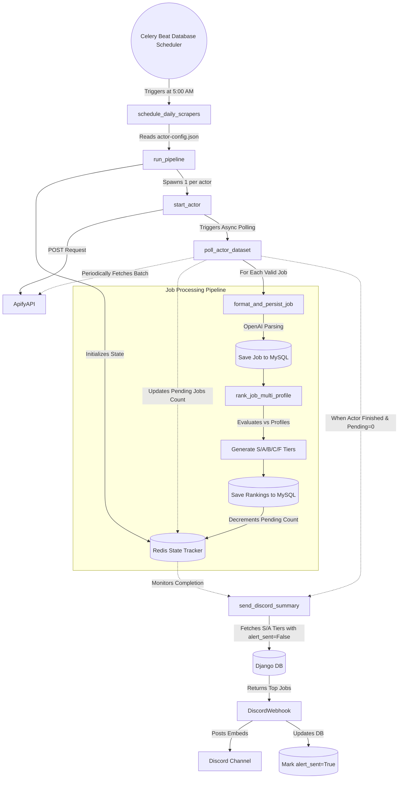

# Job Hunt AI Pipeline

An automated, asynchronous system designed to scrape, format, evaluate, and notify you about the best job opportunities matching your profile. It leverages Apify for scraping, OpenAI for resume-to-job matching, Celery for distributed task execution, and Django for data persistence and visualization.

## 🏗 Architecture Overview

The system is split into three main components:

1. **Backend (Django)**
   - Exposes REST APIs (`/api/jobs/`) for ingesting and retrieving scraped data.
   - Houses the MySQL Database for robust persistence of `Job` and `JobRanking` models.
   - Provides a fully-featured Admin Dashboard (`/admin/`) to manage scraped jobs and periodic tasks.

2. **Frontend**
   - Served natively by Django views (`jobs.web_urls`).
   - A modern, mobile-friendly interface designed with minimal client-side compute to quickly view and interact with AI-ranked jobs for the day.

3. **Async / Distributed Task Execution (Celery + Redis)**
   - Celery handles all long-running, IO-bound, and AI tasks in the background.
   - Redis acts as the message broker passing tasks between the scheduler and the worker containers.
   - **Celery Beat** triggers pipelines based on schedules defined in the database.

---

## ⚙️ How the Task Flow Works

The core of the system relies on an asynchronous pipeline. Instead of blocking and waiting for scrapers to finish, the system heavily utilizes async polling and chained callbacks.



### Detailed Flow Breakdown
1. **Trigger:** Celery Beat reads your schedule from the Django database and triggers `tasks.pipeline.schedule_daily_scrapers`.
2. **Scheduling:** The task reads `actor-config.json` to determine which scrapers are due to run today based on their `schedule_frequency`.
3. **Booting Actors:** It triggers the respective Apify actors and initializes tracking state in Redis (e.g., active actors and pending jobs).
4. **Async Polling:** Instead of blocking, the `poll_actor_dataset` task runs on a retry loop. It grabs batches of newly scraped jobs as they are collected by Apify.
5. **Processing Pipeline:** For each job, the system spins off an independent processing chain:
   - **Formatting:** Uses OpenAI to clean and structure the raw job data, persisting it to MySQL.
   - **Ranking:** Evaluates the formatted job against your predefined user profiles using OpenAI, assigning an `S`, `A`, `B`, `C`, or `F` tier and a justification summary.
6. **Completion Tracking:** As each ranking finishes, Redis is updated. When the Apify actor finishes and the pending job count hits `0`, the polling loop triggers the final notification step.

---

## 🔔 Discord Notifications

Notifications are carefully managed to avoid spam and duplication:

- **When are they sent?** Only after **all** Apify actors have finished their runs and all background formatting and ranking queues are empty.
- **What is sent?** The system queries the Django API for jobs scraped today that achieved a match tier of **S** or **A**.
- **Deduplication (`alert_sent` flag):** To ensure you aren't spammed with the same job if you run the scraper multiple times in a day, the system passes `alert_sent=False`. Once a batch of jobs is successfully sent to the Discord Webhook, an API call is made to update those specific jobs in the database to `alert_sent = True`. 

---

## 📅 How to Schedule Scrapers

Scrapers are configured in two parts:

### 1. Configuration File
Edit `actor-config.json` in the root directory. Add your Apify Actor ID, the input payload, and the `schedule_frequency` (`daily`, `every_2_days`, or `weekly`).

### 2. Django Admin (Database Scheduler)
Because we use `django-celery-beat`, schedules are managed directly in the browser:
1. Navigate to your Django Admin Dashboard (`http://localhost:8000/admin`).
2. Under **Periodic Tasks**, click **Crontabs** and add a new schedule (e.g., Minute: `0`, Hour: `5` for 5:00 AM).
3. Go to **Periodic tasks** and click **Add**.
4. Select the task: `tasks.pipeline.schedule_daily_scrapers`.
5. Attach the Crontab you just created and hit Save.

---

## 🚀 How to Setup

### Prerequisites
- Docker & Docker Compose
- Apify API Token
- OpenAI API Key
- Discord Webhook URL (Optional)

### Installation Steps

1. **Clone the repository:**
   ```bash
   git clone https://github.com/deep-astaad/job-hunt
   cd job-hunt
   ```

2. **Environment Variables:**
   Copy the example config and fill in your keys:
   ```bash
   cp .env.example .env
   ```

3. **User Profiles:**
   Ensure `user-profiles.json` exists in the root directory and contains your structured resume/profile data for the AI to rank against.

4. **Boot the Environment:**
   Run the full stack (MySQL, Redis, Django, Celery Worker, Celery Beat) via Docker:
   ```bash
   docker compose up -d --build
   ```

5. **Create an Admin Account:**
   ```bash
   docker compose exec -w /app/backend django python manage.py createsuperuser
   ```

6. **Access the App:**
   - **Frontend UI:** `http://localhost:8000/`
   - **Admin Dashboard:** `http://localhost:8000/admin/`

---

## 💸 Scraper Costs Reference

For reference, here are the estimated costs for popular Apify actors used in this pipeline:
- `misceres/indeed-scraper`: $6.00 per 1,000 runs
- `jungle_synthesizer/japan-dev-scraper`: $2.00 per 1,000 runs
- `jungle_synthesizer/tokyo-dev-scraper`: $4.00 per 1,000 runs
- `curious_coder/linkedin-jobs-scraper`: $1.00 per 1,000 runs
- `unfenced-group/daijob-scraper`: $1.50 per 1,000 runs